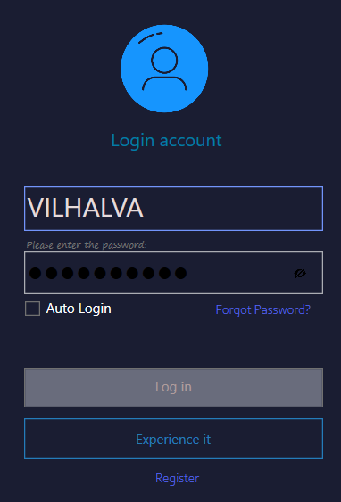

# LOGIN COM WPF
👨‍🏫APENAS INTERFACE DE FORMULARIO DE LOGIN DARK COM WPF.

  

## DESCRIÇÃO:
Este é um aplicativo WPF (Windows Presentation Foundation) para um sistema de login. Ele apresenta uma interface de usuário elegante e moderna, com elementos estilizados para uma experiência de usuário aprimorada. A interface inclui campos para entrada de usuário e senha, opções para login automático e recuperação de senha, e botões para ações de login e registro.

## FUNCIONALIDADES:
1. **Entrada de Dados**:
   - **Campo de Usuário**: TextBox para o usuário inserir seu nome de usuário.
   - **Campo de Senha**: PasswordBox para o usuário inserir sua senha com segurança.

2. **Opções de Acesso**:
   - **Auto Login**: CheckBox para selecionar a opção de login automático em futuras sessões.
   - **Recuperação de Senha**: Botão "Forgot Password?" para redirecionar o usuário para o processo de recuperação de senha.
   - **Registro**: Botão "Register" para redirecionar o usuário para o formulário de registro.

3. **Ações de Login**:
   - **Botão de Login**: Botão "Log in" para submeter as credenciais e tentar realizar o login.
   - **Botão de Experiência**: Botão "Experience it" para fornecer uma demonstração ou experiência do aplicativo.

## EXECUTANDO O PROJETO:
### ABRINDO NO VISUAL STUDIO:
- Abra o projeto `./CODIGO` no Visual Studio:
  1. Abra o Visual Studio.
  2. Clique em `File` > `Open` > `Project/Solution`.
  3. Navegue até o diretório `./CODIGO`.
  4. Selecione o arquivo da solução (`.sln`) do projeto e clique em `Open`.
  5. No Solution Explorer, abra o arquivo `Program.cs` para ver o código-fonte.

#### COMPILANDO E EXECUTANDO O PROJETO:
1. Pressione `Ctrl + Shift + B` para compilar o projeto.
2. Após a compilação, pressione `Ctrl + F5` para executar o projeto sem depuração.

### ABRINDO O EXECUTÁVEL:
- Abra o executável em `CODIGO/WpfApp11/bin/Debug/WpfApp11.exe`:
  1. Abra o Explorador de Arquivos.
  2. Navegue até o diretório `CODIGO/WpfApp11/bin/Debug`.
  3. Dê um duplo clique no arquivo `WpfApp11.exe` para executar o aplicativo.

### INTERAGINDO COM APP:
1. **Iniciar o Aplicativo**:
   - Abra o aplicativo. A janela principal (`MainWindow`) será exibida.

2. **Entrar com Credenciais**:
   - **Nome de Usuário**: Insira o nome de usuário no campo de texto (`TextBox`).
   - **Senha**: Insira a senha no campo de senha (`PasswordBox`).

3. **Opções de Acesso**:
   - **Auto Login**: Se desejar que o aplicativo lembre suas credenciais para logins futuros, marque a opção "Auto Login".
   - **Esqueceu a Senha?**: Clique no botão "Forgot Password?" para iniciar o processo de recuperação de senha.

4. **Realizar Login**:
   - Clique no botão "Log in" para enviar suas credenciais. Se as credenciais estiverem corretas, você será redirecionado para a próxima página ou funcionalidade do aplicativo.

5. **Registrar**:
   - Se você não tiver uma conta, clique no botão "Register" para abrir o formulário de registro e criar uma nova conta.

6. **Experiência**:
   - Para experimentar ou visualizar uma demonstração do aplicativo, clique no botão "Experience it".

## NÃO SABE?
- Entendemos que para manipular arquivos nas linguagens relacionadas, é necessário possuir conhecimento nessas áreas. Para auxiliar nesse aprendizado, oferecemos cursos gratuitos disponíveis:
* [CURSO DE WPF](https://github.com/VILHALVA/CURSO-DE-WPF)
* [CURSO DE C#](https://github.com/VILHALVA/CURSO-DE-C-SHARP)
* [CONFIRA MAIS CURSOS](https://github.com/VILHALVA?tab=repositories&q=+topic:CURSO)

## CREDITOS:
- [PROJETO CRIADO PELO "EbrahimShafiey"](https://github.com/EbrahimShafiey/LogInPage)
- [PROJETO FEITO PELO VILHALVA](https://github.com/VILHALVA)

